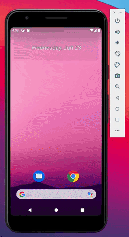

# Project 1 - *SimpleTodo*

SimpleTodo is an android app that allows building a todo list and basic todo items management functionality including adding new items, editing and deleting an existing item.

Submitted by: **Samantha Bautista**

Time spent: **7** hours spent in total

## User Stories

The following **required** functionality is completed:

* [x] User can **view a list of todo items**
* [x] User can **successfully add and remove items** from the todo list
* [x] User's **list of items are persisted** across app restarts

The following **bonus** features are implemented:

* [x] User can **tap a todo item in the list and bring up an edit screen for the todo item** and then have any changes to the text reflected back in the todo list

## Video Walkthrough

Here's a walkthrough of implemented user stories:

GIF created with QuickTime Player and [Giphy](giphy.com).

## Notes
- Used an old API (API 21) that couldn't download the newer packages. The solution was to start the project again with a newer API and copy the content of the previous project.

## License

    Copyright 2021 Samantha Bautista

    Licensed under the Apache License, Version 2.0 (the "License");
    you may not use this file except in compliance with the License.
    You may obtain a copy of the License at

        http://www.apache.org/licenses/LICENSE-2.0

    Unless required by applicable law or agreed to in writing, software
    distributed under the License is distributed on an "AS IS" BASIS,
    WITHOUT WARRANTIES OR CONDITIONS OF ANY KIND, either express or implied.
    See the License for the specific language governing permissions and
    limitations under the License.
